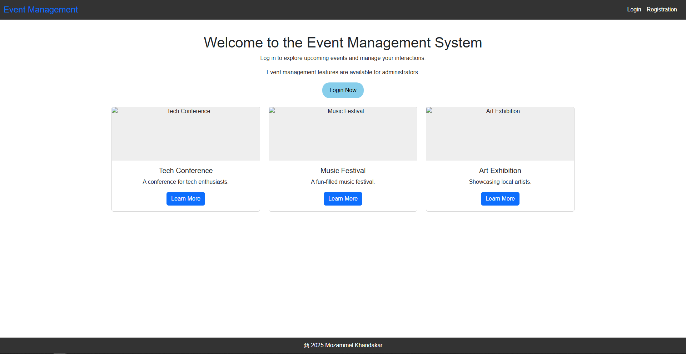
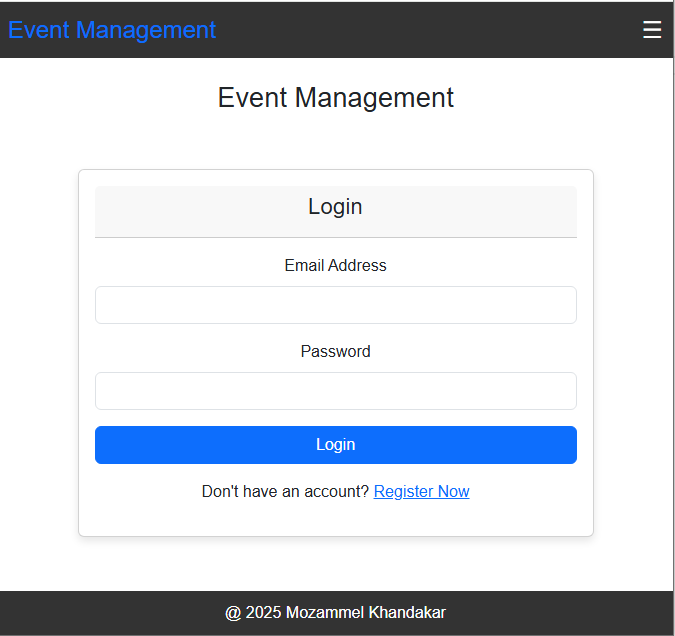
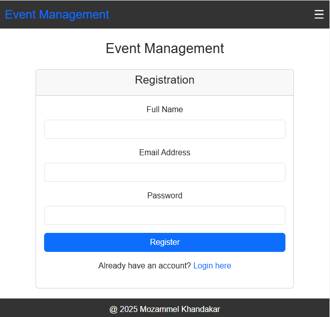
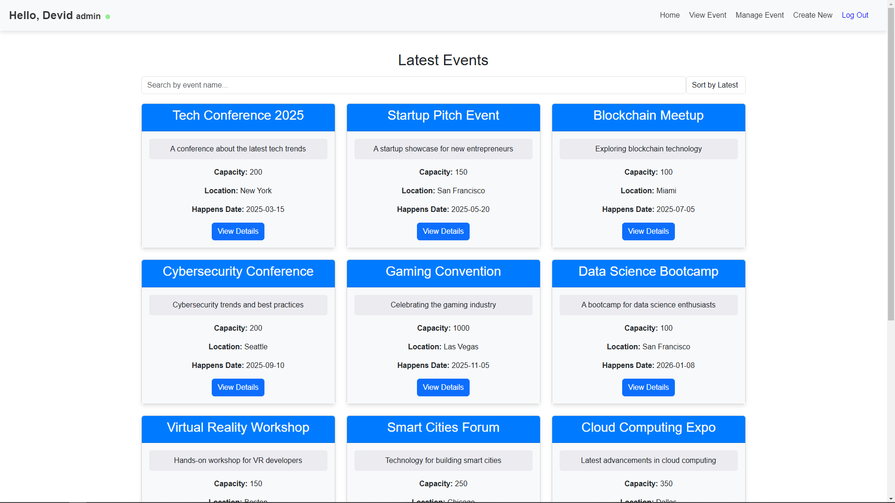
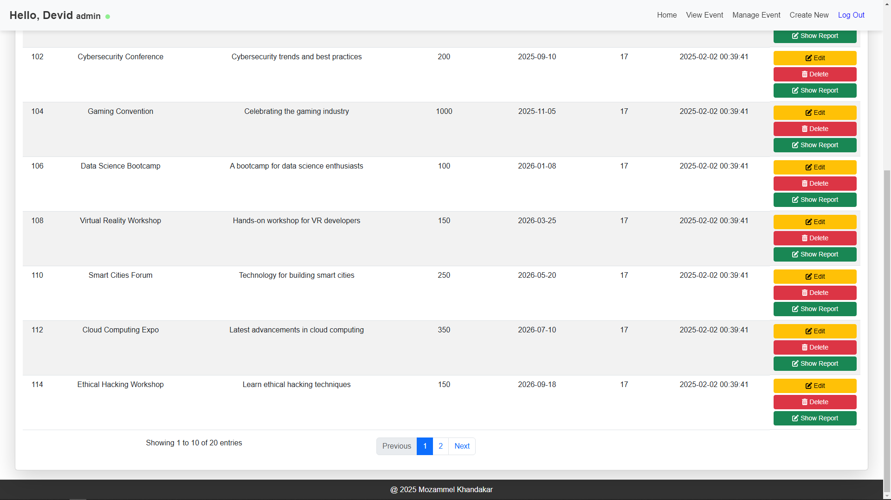

# EventManagement
It's an event manageent projct.
## Features

- **User Authentication**: Secure login and registration system for users.
- **Event Creation**: Users can create and manage their own events.
- **Event Registration**: Users can register for events.
- **Admin Panel**: Admins can manage events
- **Responsive Design**: Mobile-friendly design for accessibility on all devices.

## Installation

1. Clone the repository:
    git clone https://github.com/KM-Mozammel/EventManagement.git

Index page/

Login:

Registration:

After Login user will redirect here in the dashboard :

Registered event:

Manage Eventh:

Create new Event:

Join to an event

